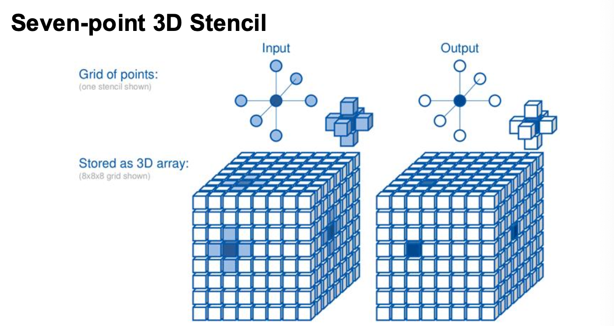

As indicated in my previous CUDA posts, this one is also a prettified version of my lecture notes. So it's not a proper tutorial and it requires prior knowledge.

A stencil is a computation pattern similar to a convolution, where neighboring cells around a target point are combined through a fixed linear transformation and projected onto the target. The difference compared to a convolution is that there's no proper filter — just a fixed set of coefficients applied to a fixed neighborhood pattern. Stencils are mostly used in 3D grids, so we'll be working with a 7-point stencil: the target point plus its 6 face neighbors.



The CPU implementation looks like this:

```cpp
#define get(data, i, j, k, N) data[(i) *N * N + (j) *N + (k)]

void stencil_cpu(const float *in, float *out, const int N) {
  for (int i = 1; i < N - 1; ++i)
    for (int j = 1; j < N - 1; ++j)
      for (int k = 1; k < N - 1; ++k)
        get(out, i, j, k, N) = c0 * get(in, i, j, k, N) + c1 * get(in, i, j, k - 1, N) +
                               c2 * get(in, i, j, k + 1, N) + c3 * get(in, i, j - 1, k, N) +
                               c4 * get(in, i, j + 1, k, N) + c5 * get(in, i - 1, j, k, N) +
                               c6 * get(in, i + 1, j, k, N);
}
```

The two costs we'll be chipping away at are: how much *global memory traffic* we generate per output point, and how well we *exploit data reuse* between neighboring output points (since adjacent outputs share most of their input neighborhood).

## Naive GPU implementation

One thread per output point, where each thread reads the 6 neighbors plus the target point and writes one output value.

```cpp
__global__ void stencil_kernel_gpu(const float *__restrict__ in, float *__restrict__ out, const int N) {
  const unsigned int i = blockIdx.z * blockDim.z + threadIdx.z;
  const unsigned int j = blockIdx.y * blockDim.y + threadIdx.y;
  const unsigned int k = blockIdx.x * blockDim.x + threadIdx.x;

  if (i >= 1 && i < N - 1 && j >= 1 && j < N - 1 && k >= 1 && k < N - 1) {
    get(out, i, j, k, N) = c0 * get(in, i, j, k, N) + c1 * get(in, i, j, k - 1, N) +
                           c2 * get(in, i, j, k + 1, N) + c3 * get(in, i, j - 1, k, N) +
                           c4 * get(in, i, j + 1, k, N) + c5 * get(in, i - 1, j, k, N) +
                           c6 * get(in, i + 1, j, k, N);
  }
}
```

Each thread performs 13 floating-point operations (7 multiplies + 6 adds) and loads seven 4-byte values from global memory, giving an arithmetic intensity of *0.46 FLOP/B*. Better than the convolution baseline, but still memory-bound. The two main levers we can pull are *coarsening* (have each thread do more work, increasing ops per byte loaded) and *tiling* (reuse data between threads via shared memory, reducing the bytes loaded in the first place).

## Tiling

We load a `block_dim³` chunk of the input into shared memory, then have the threads on the halo region sit idle while the threads in the active region do the compute over the shared memory. The block size directly impacts the size of the shared memory we need, which can limit or degrade block occupancy on the SM. So the gain from tiling here is smaller than what we got with convolutions — in 3D the halo grows as a surface around the volume, so a bigger fraction of threads end up being halo-only.

```cpp
  __shared__ float in_s[IN_TILE_DIM][IN_TILE_DIM][IN_TILE_DIM];
  // Greater than 0 not required since unsigned int is used
  if (i < N && j < N && k < N) {
    in_s[threadIdx.z][threadIdx.y][threadIdx.x] = get(in, i, j, k, N);
  }
  __syncthreads();

  if (i >= 1 && i < N - 1 && j >= 1 && j < N - 1 && k >= 1 && k < N - 1) {
    if (threadIdx.z >= 1 && threadIdx.z < IN_TILE_DIM - 1 && threadIdx.y >= 1 &&
        threadIdx.y < IN_TILE_DIM - 1 && threadIdx.x >= 1 && threadIdx.x < IN_TILE_DIM - 1) {
      get(out, i, j, k, N) = c0 * in_s[threadIdx.z][threadIdx.y][threadIdx.x] +
                             c1 * in_s[threadIdx.z][threadIdx.y][threadIdx.x - 1] +
                             c2 * in_s[threadIdx.z][threadIdx.y][threadIdx.x + 1] +
                             c3 * in_s[threadIdx.z][threadIdx.y - 1][threadIdx.x] +
                             c4 * in_s[threadIdx.z][threadIdx.y + 1][threadIdx.x] +
                             c5 * in_s[threadIdx.z - 1][threadIdx.y][threadIdx.x] +
                             c6 * in_s[threadIdx.z + 1][threadIdx.y][threadIdx.x];
    }
  }
}
```

## Coarsening & slicing

Make each thread iterate through the z-axis, increasing the amount of ops done per thread and reducing the total thread count from $T^3$ to $T^2$.

The key observation is that the 7-point stencil only needs three z-planes at any moment: the current plane (where the output is computed), the previous plane (one neighbor), and the next plane (one neighbor). So instead of storing a full 3D slice of size $T^3$ for each block, we can keep just $3 \cdot T^2$ points in shared memory — one plane for prev, one for current, one for next. On each iteration we read the new plane and discard the old one. For $T = 32$, this brings shared memory from $32 \times 32 \times 32 \times 4\text{B} = 128\text{KB}$ down to $32 \times 32 \times 4\text{B} \times 3 = 12\text{KB}$.

```cpp
__global__ void
    stencil_kernel_coarsening_tiling_gpu(const float *__restrict__ in, float *__restrict__ out, const int N) {
  const unsigned int i_start = blockIdx.z * Z_SLICING;
  const unsigned int j       = blockIdx.y * OUT_TILE_DIM + threadIdx.y - 1;
  const unsigned int k       = blockIdx.x * OUT_TILE_DIM + threadIdx.x - 1;

  __shared__ float in_prev_s[IN_TILE_DIM][IN_TILE_DIM];
  __shared__ float in_curr_s[IN_TILE_DIM][IN_TILE_DIM];
  __shared__ float in_next_s[IN_TILE_DIM][IN_TILE_DIM];
  // Check greater than 0 not needed since index is an unsigned int
  if (i_start - 1 < N && j < N && k < N) {
    in_prev_s[threadIdx.y][threadIdx.x] = get(in, i_start - 1, j, k, N);
  }
  if (i_start < N && j < N && k < N) {
    in_curr_s[threadIdx.y][threadIdx.x] = get(in, i_start, j, k, N);
  }
  for (unsigned int i = i_start; i < i_start + Z_SLICING; ++i) {
    // Check greater than 0 not needed since index is an unsigned int
    if (i + 1 < N && j < N && k < N) {
      in_next_s[threadIdx.y][threadIdx.x] = get(in, i + 1, j, k, N);
    }
    __syncthreads();

    if (i >= 1 && i < N - 1 && j >= 1 && j < N - 1 && k >= 1 && k < N - 1) {
      if (threadIdx.y >= 1 && threadIdx.y < IN_TILE_DIM - 1 && threadIdx.x >= 1 &&
          threadIdx.x < IN_TILE_DIM - 1) {
        get(out, i, j, k, N) =
            c0 * in_curr_s[threadIdx.y][threadIdx.x] + c1 * in_curr_s[threadIdx.y][threadIdx.x - 1] +
            c2 * in_curr_s[threadIdx.y][threadIdx.x + 1] + c3 * in_curr_s[threadIdx.y - 1][threadIdx.x] +
            c4 * in_curr_s[threadIdx.y + 1][threadIdx.x] + c5 * in_prev_s[threadIdx.y][threadIdx.x] +
            c6 * in_next_s[threadIdx.y][threadIdx.x];
      }
    }
    __syncthreads();

    in_prev_s[threadIdx.y][threadIdx.x] = in_curr_s[threadIdx.y][threadIdx.x];
    in_curr_s[threadIdx.y][threadIdx.x] = in_next_s[threadIdx.y][threadIdx.x];
  }
}
```

## Register tiling

We can push this further and reduce shared memory usage even more. The key insight is that we only depend on *other threads' values* through the current plane — for the prev and next planes, each thread only reads its own $(j, k)$ position, never a neighbor's. So those two planes don't really need to live in shared memory at all; they can sit in registers, private to each thread.

So we keep only the current plane in shared memory, and store the prev and next values in registers. Memory usage drops from $3 T^2$ to $T^2$ in shared memory, plus 2 registers per thread. The compute step now does 2 register reads (prev and next) and 5 shared memory reads (target plus 4 neighbors in the current plane).

```cpp
__global__ void
    stencil_kernel_register_tiling_gpu(const float *__restrict__ in, float *__restrict__ out, const int N) {
  const unsigned int i_start = blockIdx.z * Z_SLICING;
  const unsigned int j       = blockIdx.y * OUT_TILE_DIM + threadIdx.y - 1;
  const unsigned int k       = blockIdx.x * OUT_TILE_DIM + threadIdx.x - 1;

  float in_prev;
  __shared__ float in_curr_s[IN_TILE_DIM][IN_TILE_DIM];
  float in_next;
  // Check greater than not needed since index is an unsigned int
  if (i_start - 1 < N && j < N && k < N) {
    in_prev = get(in, i_start - 1, j, k, N);
  }
  if (i_start < N && j < N && k < N) {
    in_curr_s[threadIdx.y][threadIdx.x] = get(in, i_start, j, k, N);
  }
  for (unsigned int i = i_start; i < i_start + Z_SLICING; ++i) {
    // Check greater than not needed since index is an unsigned int
    if (i + 1 < N && j < N && k < N) {
      in_next = get(in, i + 1, j, k, N);
    }
    __syncthreads();
    if (i >= 1 && i < N - 1 && j >= 1 && j < N - 1 && k >= 1 && k < N - 1) {
      if (threadIdx.y >= 1 && threadIdx.y < IN_TILE_DIM - 1 && threadIdx.x >= 1 &&
          threadIdx.x < IN_TILE_DIM - 1) {
        get(out, i, j, k, N) =
            c0 * in_curr_s[threadIdx.y][threadIdx.x] + c1 * in_curr_s[threadIdx.y][threadIdx.x - 1] +
            c2 * in_curr_s[threadIdx.y][threadIdx.x + 1] + c3 * in_curr_s[threadIdx.y - 1][threadIdx.x] +
            c4 * in_curr_s[threadIdx.y + 1][threadIdx.x] + c5 * in_prev + c6 * in_next;
      }
    }
    __syncthreads();
    in_prev                             = in_curr_s[threadIdx.y][threadIdx.x];
    in_curr_s[threadIdx.y][threadIdx.x] = in_next;
  }
}
```

The algorithmic complexity stays the same as the coarsened version, but shared memory usage drops by 2/3, which can help further improve block occupancy.

### More registers vs more shared memory

From a performance standpoint, the tradeoff between more shared memory or more registers depends on the specific GPU's specs, so it should be determined with the profiler's help. In some cases the coarsened approach actually beats register tiling — if you push the register count too high per thread, you can reduce the number of warps that fit on the SM, which hurts occupancy from a different angle.

## Summary

| Kernel | Shared memory | Registers | Threads per block | Notes |
|---|---|---|---|---|
| Naive | — | — | $T^3$ | 0.46 FLOP/B, memory-bound |
| Tiling | $T^3$ | — | $T^3$ | halo threads idle during compute |
| Coarsening + slicing | $3 T^2$ | — | $T^2$ | each thread walks the z-axis |
| Register tiling | $T^2$ | 2 per thread | $T^2$ | prev/next in registers |

The takeaways:

- **Tiling and privatization** to improve performance (limited by the number of spawned threads and the shared memory per block)
- **Coarsening and slicing** to overcome the limit on block size
- **Register tiling** to overcome the shared memory limitations